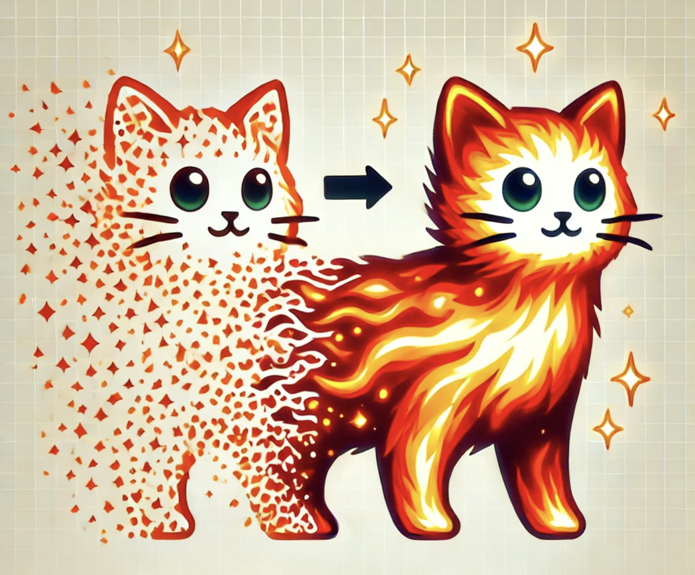

# poke-fantasia

> **⚠️ Deprecation Notice:**  
> This repository is no longer maintained and is considered deprecated. For alternatives or questions, please refer to the original [poke-fantasia repository](https://github.com/harryo583/poke-fantasia).

Final project monorepo for NU CS_310 Scalable Software Architectures

This project implements a CycleGAN model to transform generic images into a user-selected Pokémon style. The CycleGAN framework enables unpaired image-to-image translation, allowing the creation of stylized images without requiring paired datasets. The project is built with PyTorch and utilizes torchvision for data preprocessing and augmentation.

## Key features

Key features include:
- Customizable training duration.
- Checkpoint saving for resuming training.
- Inference script for generating styled images.

## Attribution

This project uses parts of the CycleGAN repository:
https://github.com/junyanz/pytorch-CycleGAN-and-pix2pix

The file `networks.py` is derived from this repository and modified to suit our use case. The original work is licensed under the BSD 3-Clause License.